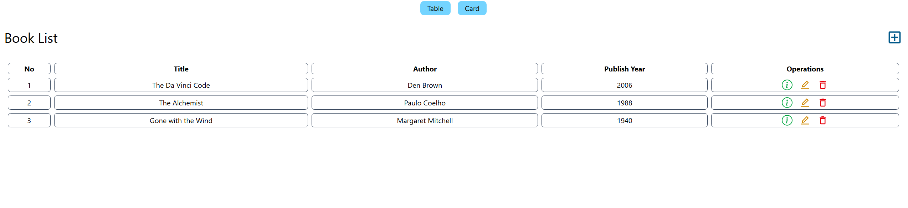
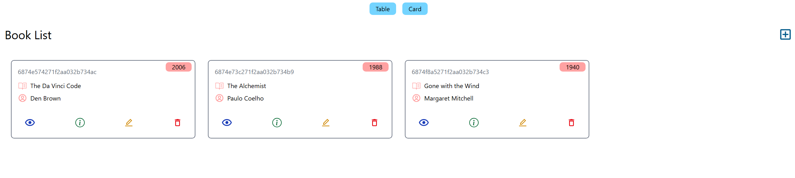
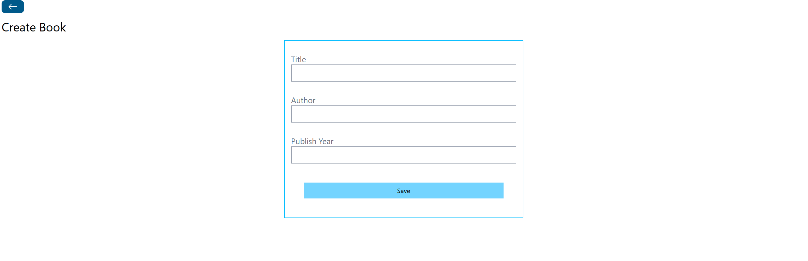
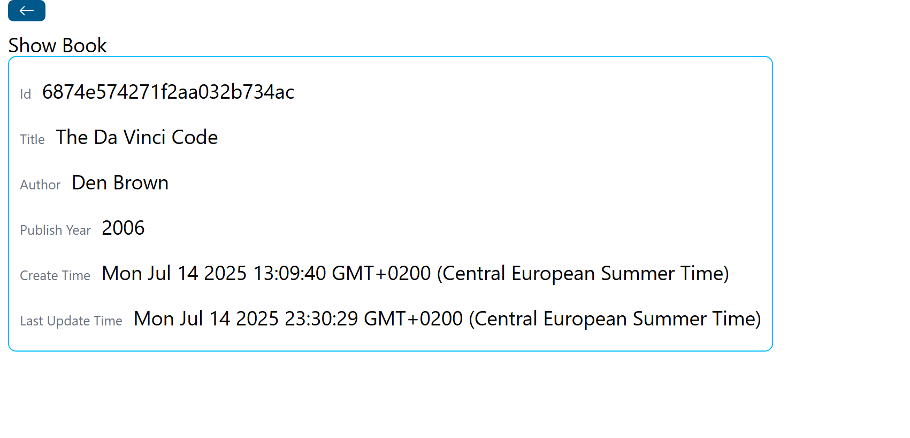
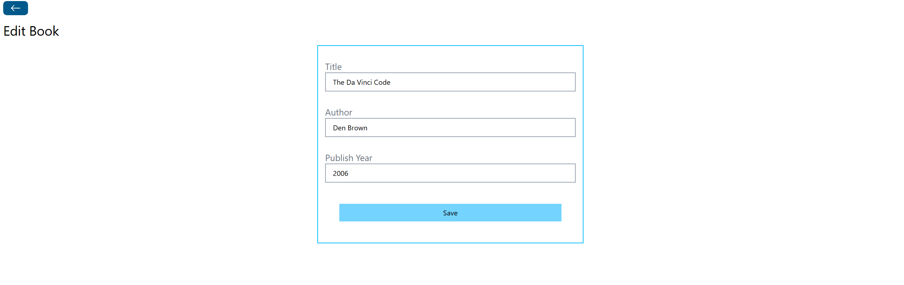

# 📚 Book Store

Book Store is a simple web application designed to showcase CRUD (Create, Read, Update, Delete) operations in a frontend environment.  
This project demonstrates the ability to manage data, update UI dynamically, and handle user interactions.

---

## 🚀 Features

- View all books
- Add new books
- API built with Express & MongoDB (Mongoose)
- Frontend built with React + Tailwind CSS
- RESTful routing

---

## 🛠️ Technologies Used

- **Frontend**: React, Tailwind CSS
- **Backend**: Node.js, Express.js
- **Database**: MongoDB with Mongoose
- **Other tools**: Vite, Axios, CORS

---

## 🧠 What I Learned

- Implementing basic CRUD functionality in React
- Managing component state and props
- Dynamic rendering based on state changes
- Updating UI in response to user interactions

---

## 📸 Screenshots

---

## 🚀 Live Demo

Frontend: (https://book-store-18fj.vercel.app/)

---

## 🔮 Possible Improvements

- Add search and filter functionality
- Improve UI styling
- Add unit tests

---

## 👤 Author

Anka Knežević 

Junior Frontend / Full-Stack Developer

GitHub: https://github.com/anka131
